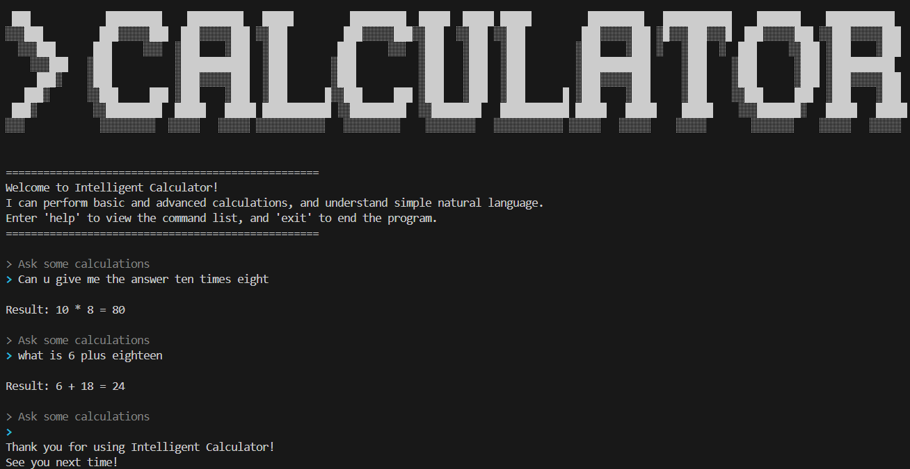
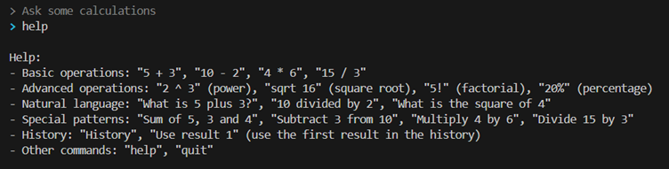

# AI411 Intelligent Calculator

A natural language-based calculator that interprets everyday language (e.g., "What is 12 times 4?") into mathematical operations.

## Features

- **Natural Language Processing** — Converts conversational input to mathematical expressions
- **Smart Correction** — Suggests corrections for typos using fuzzy matching
- **Multiple Operations** — Addition, subtraction, multiplication, division, factorial, square root, power, percentage
- **Calculation History** — Saves and displays past calculations
- **Multilingual Interface** — Supports multiple languages for commands

## Supported Operations

| Input Format | Example |
|--------------|---------|
| Addition | "12 plus 5", "add 12 and 5", "sum of 12, 5 and 3" |
| Subtraction | "10 minus 3", "subtract 3 from 10", "subtract 3, 5 and 2 from 10" |
| Multiplication | "4 times 6", "multiply 4 by 6" |
| Division | "20 divided by 4", "divide 20 by 4" |
| Power | "3 squared", "2 power 3", "power of 2 to 3", "2 to the power of 3" |
| Square Root | "sqrt of 16", "square root of 9" |
| Factorial | "5 factorial" |
| Percentage | "20 percent of 50" |

## Installation

```bash
pip install text2digits sty difflib
```

## Usage

```bash
python intelligentCalc.py
```

## Example




## Tech

- Python
- text2digits — Text to number conversion
- difflib — Fuzzy string matching
- sty — Terminal string styling
